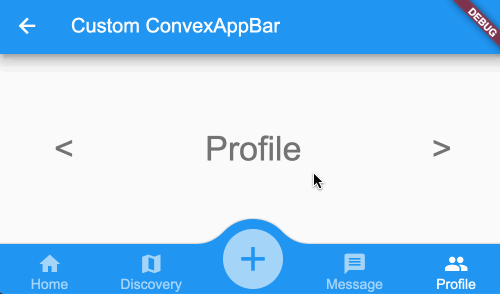

# Change active tab index programmaticlly

There ae some cases that you may want to change the activate tab index;
* define a custom initial index
* change index according to PageView/TabBarView

## Change initial index

The `ConvexAppbar` are exposed with `initialActivieIndex`, this value will be used when the appbar are constructed.

## Work with PageView/TabBarView
The TabBarView use PageView internal, both support swipe gesture to change current page content;



ConvexAppBar can work with `TabController` similar with `TabBar`;

In order to change the index of tab item, config the AppBar with instance of `TabController`; To simplify the code, you can use `DefaultTabController`:

**Example 1**  
```dart
DefaultTabController(
  length: 5,
  child: Scaffold(
    appBar: AppBar(title: const Text('Custom ConvexAppBar')),
    body: TabBarView(
      children: ['A','B','C','D','E']
          .map((i) => Center(child: Text('$i')))
          .toList(growable: false),
    ),
    bottomNavigationBar: ConvexAppBar(/* some config*/),
  ),
);
```

**Example 2**  
```dart
 Scaffold(
  appBar: AppBar(title: const Text('Custom ConvexAppBar')),
  body: TabBarView(
    controller: _tabController,
    children: ['A','B','C','D','E']
        .map((i) => Center(child: Text('$i')))
        .toList(growable: false),
  ),
  bottomNavigationBar: ConvexAppBar(controller: _tabController/* some config*/),
);
``` 
## The raw way
If you don't use TabController at all, then you have to update tab index manually through `ConvexAppBarState`.
This usually requires a defined `GlobalKey` set with `ConvexAppBar`:

```dart
// define field instance
GlobalKey<ConvexAppBarState> _appBarKey = GlobalKey<ConvexAppBarState>();
// construct with key
ConvexAppBar(key: _appBarKey, /* ... */);
// access related State when necessary such as onPageChanged
_appBarKey.currentState.animateTo(2/* index*/);
```